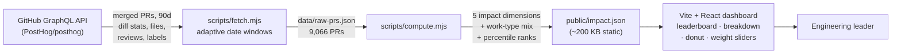

# PostHog Engineering Impact Dashboard

An interactive, single-page dashboard that identifies the **top 5 most impactful engineers**
at PostHog over the last 90 days, using real data from the
[`PostHog/posthog`](https://github.com/PostHog/posthog) GitHub repository.

**Live dashboard:** https://posthog-impact-dashboard-pi.vercel.app

---

## What "impact" means here

Lines of code, commit counts, and PR counts are easy to game and don't reflect real
engineering impact. A 2,000-line auto-generated migration is not 10x a tight 200-line bug
fix, and the engineer who unblocks five teammates through reviews often matters more than
the one with the biggest diff.

So impact is modeled as **five complementary dimensions**, each capturing a different kind
of value an engineer creates:

| Dimension | Default weight | Raw signal | Why it matters |
|---|---|---|---|
| **Shipping** | 25% | Log-dampened code volume across merged PRs | Visible shipped work, with a log scale so large mechanical diffs don't dominate |
| **Review Leverage** | 25% | Reviews given on *other people's* PRs | Engineers who multiply the output of others — a force multiplier raw stats miss |
| **Area Ownership** | 15% | Distinct code areas (top-level dirs) touched | Cross-cutting reach vs. siloed work |
| **Delivery Signal** | 15% | Share of bug-fix / test PRs | Keeping delivery healthy, not just adding features |
| **Scope Handled** | 20% | Distinct "hotspot" (high-churn) core files touched | Working on the central, high-traffic code others depend on |

These five blend into a single **Visible Impact Score (0–100)** — a Weave-inspired "normalized
unit" of visible engineering work, not a line-count.

### How the score is computed

1. For each engineer we compute the **raw value** of each dimension.
2. Each raw value is converted to a **percentile rank (0–100)** against all *qualified*
   contributors (those with ≥3 merged PRs in the window, bots excluded). Percentiles make
   dimensions comparable and resistant to outliers.
3. The final **impact score (0–100)** is the weighted blend of the five percentiles.

Every number on the dashboard is explained and traceable: each engineer card shows the raw
inputs (PRs, reviews given, subsystems, bug-fix %, hotspot files) **and** the normalized
component scores, plus links to their most-reviewed PRs so a leader can validate the ranking.
The **weight sliders** let you re-weight the dimensions live and pressure-test who rises to
the top.

## Work Type Mix — *what kind* of impact

Impact answers *who* and *how much*; the **Work Type Mix** answers **what kind**. Every PR is
classified into one of seven buckets with a lightweight, rule-based classifier (no ML), using
a clear priority order:

1. **Conventional-commit prefix** in the title (`feat:` → Feature, `fix:` → Bug Fix,
   `refactor:`/`perf:` → Refactor, `docs:` → Docs, `test:` → Tests, `ci:`/`build:` →
   Infrastructure, `chore:` → Maintenance, `chore(deps)` → Infrastructure)
2. **Labels** (e.g. `bug`, `enhancement`, `documentation`, `dependencies`)
3. **Title keywords** (fix / refactor / cleanup / docs …)
4. **Changed-file majority** (mostly `tests/` → Tests, mostly `docs/`/`*.md` → Docs, mostly
   CI/Docker/lockfiles → Infrastructure)
5. Sensible default (Feature if it reads like new functionality, else Maintenance)

Each PR gets exactly **one** type, so an engineer's mix sums to 100%. The dashboard shows each
engineer's mix as a **donut + top-2 summary** ("Mostly Feature & Bug Fix"), and a team-wide
**"What the team shipped"** strip gives the leader an at-a-glance picture of where effort went.

## Impact Lens & Leadership Insights

Beyond the ranking, the dashboard answers *what kind* of impact each person has and *what is
happening inside the team* — closer to how an engineering-intelligence tool thinks:

- **Impact Lens** (per engineer): a rule-based archetype (Product Shipper, Technical Multiplier,
  Systems Owner, Full-Stack Owner, Quality Improver, Area Specialist, Balanced Contributor), a
  one-line leadership takeaway, and a **confidence badge** (High / Medium / Low) based on how much
  public evidence backs the call.
- **Work Type Mix**: every PR is bucketed into Feature / Bug Fix / Infrastructure / Refactor /
  Tests / Docs / Maintenance, shown per engineer and team-wide.
- **Review Leverage**: who unblocks the team most through reviews on others' PRs.
- **AI-Readiness Proxy**: a *directional* split of work that looks repetitive/well-scoped
  (potentially AI-assistable) vs. judgment-heavy (large, security-sensitive, architectural).
  **This is not AI attribution** — public GitHub data can't prove AI usage — it's a proxy from PR
  metadata (work type, size, files touched), clearly labelled as such in the UI.

Honesty is built into the copy throughout: "visible impact", "public GitHub signal",
"directional", "proxy", and an explicit note that this is **not a performance review** and can't
see private mentoring, planning, design, incidents, or Slack help.

## Benchmarking & trends

Impact is only meaningful relative to peers and over time, so the dashboard adds:

- **Benchmark framing** — each engineer is labelled by where they sit in the distribution
  ("Rank #1 · Top 1%"), and every impact-breakdown bar shows reference ticks for the team
  **median (50th)** and **top 10% (90th)** percentile, so "good" has an explicit yardstick.
- **13-week activity trend** — a per-engineer sparkline plus a normalised **PRs / week** rate,
  so a leader sees consistency and momentum, not just a 90-day total.

## Future work (with richer data)

The dashboard ships an **AI-readiness *proxy*** (directional, from PR metadata), but real
**AI vs. human attribution** — how much of each engineer's output was actually AI-assisted
(Cursor / Copilot / Claude) — can't be inferred from public GitHub data alone; it needs commit
co-author trailers or editor telemetry. Rather than guess, that is left as the natural next step.
With that signal, the same percentile/benchmark approach would extend cleanly to an "augmented
output" dimension.

## Architecture



Two clean stages: a **fetch** step (network) and a pure **compute** step (deterministic), so
the model can be re-tuned instantly without re-hitting the API. Data is **pre-computed into a
static JSON** and baked into the build, so the dashboard makes zero API calls at load time and
renders in well under a second.

## Reproduce

```bash
npm install
npm run fetch          # node scripts/fetch.mjs  (needs an authenticated `gh` CLI)
node scripts/compute.mjs
npm run dev            # or: npm run build && npm run preview
```

## Tech stack

Vite + React for the UI (charts are hand-rolled inline SVG/CSS — no chart library, ~48 KB
gzipped). Data pipeline in Node using the GitHub GraphQL API via the `gh` CLI. Hosted on Vercel.

## Time spent

**~27 minutes** (timer: started 23:27, finished 23:54).

## Approach (short)

1. Confirmed scope and data volume: PostHog merged ~9,000 PRs in 90 days, so the pipeline
   uses the GitHub GraphQL API (100 PRs/request with diff stats, files, reviews, labels) and
   slices the window into chunks that adaptively split when they exceed the 1,000-result cap —
   guaranteeing complete data (9,066 PRs captured).
2. Defined impact as five complementary, percentile-normalized dimensions (shipping,
   collaboration, breadth, quality, influence) so no single gameable metric dominates.
3. Pre-computed everything into a static JSON for instant loads, and built a transparent
   single-page dashboard where every score traces back to raw, linkable evidence and the
   weights are adjustable live.
